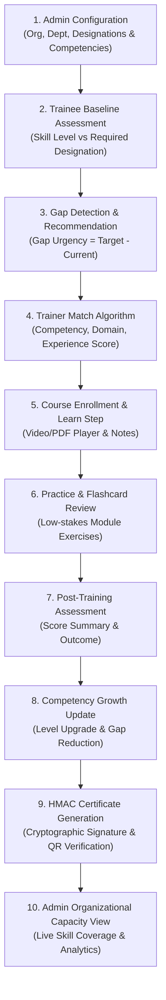

# Kuma Capacity Connect — System Architecture & Data Catalog

This document details the architectural design, database collection ownership, security models, REST API specifications, core operational data flow, and known system limitations of **Kuma Capacity Connect**.

---

## 1. Database Collections & Ownership Matrix

| Collection Path | Read Access | Write Access | Description & Key Fields |
| :--- | :--- | :--- | :--- |
| `users/{uid}` | Same user / Admin | Same user / Admin | Core user identity document (`role`, `approvalStatus`, `organization`, `department`, `designation`). |
| `organizations/{id}` | Authenticated (same org) | Admin | Organization registry (`name`, `code`, `status`). |
| `departments/{id}` | Authenticated (same org) | Admin | Organizational department definitions (`name`, `orgId`). |
| `designations/{id}` | Authenticated (same org) | Admin | Organizational designation definitions with required competencies (`requiredCompetencies`). |
| `competencyCatalog/{id}` | Authenticated | Admin | Platform-wide competency catalog (`name`, `category`, `numericLevel`). |
| `courses/{id}` | Authenticated (published) | Course Owner (Trainer) | Course catalog metadata (`title`, `ownerTrainerId`, `status`, `competencyIds`). |
| `courses/{id}/modules/{id}` | Authenticated (published) | Course Owner (Trainer) | Course syllabus modules (`title`, `type`, `resourceRef`, `required`). |
| `assessments/{courseId}` | Enrolled Trainee / Trainer | Course Owner (Trainer) | Course assessment questions (`questions`, `passingScore`, `timeLimitMinutes`). |
| `assessmentKeys/{courseId}` | Course Owner / Admin | Course Owner (Trainer) | Answer keys for assessment grading (`answerKeys`). |
| `trainingEnrollments/{id}` | Trainee / Trainer / Admin | Trainee / System | Trainee course enrollment and module completion progress (`completedModuleIds`, `completionRate`). |
| `competencyRecords/{id}` | Trainee / Admin | Trainee / System | Trainee competency history (`declaredLevel`, `assessedLevel`, `history`). |
| `assessmentAttempts/{id}` | Trainee / Admin | Trainee / System | Immutable record of submitted assessment attempt (`score`, `passed`, `answers`). |
| `certificates/{id}` | Public | Trainee / System | Issued completion certificate with cryptographic HMAC-SHA256 signature (`hmacSignature`). |
| `trainerProfiles/{uid}` | Authenticated | Trainer Owner | Discovery-safe trainer profile (`fullName`, `specialization`, `skills`, `competencies`). |
| `traineeProfiles/{uid}` | Trainee / Trainer / Admin | Trainee Owner | Trainee profile details and declared competencies. |
| `auditLog/{id}` | Admin | Admin / Server | Administrative action audit log (`actorUid`, `action`, `details`, `timestamp`). |

---

## 2. Security Rules & Access Control Model

1. **Administrative Access**:
   - Granted **exclusively by custom claims** (`request.auth.token.admin == true`) set via `firebase-admin`.
   - Cannot be spoofed client-side or derived from Firestore document fields.
2. **Trainer Course Ownership**:
   - Approved trainers (`approvalStatus == 'approved'`) can create and edit courses only when `request.auth.uid == resource.data.ownerTrainerId`.
3. **Trainee Data Privacy**:
   - Trainees have read and write access to their own `trainingEnrollments`, `notes`, `practiceResults`, and `assessmentAttempts`.
4. **Certificate Public Verification**:
   - Issued certificates in `certificates/{id}` are publicly readable to allow verification without authentication via `/verify-certificate`.

---

## 3. REST API Catalog (`server/index.js`)

| Method | Endpoint Path | Authorization | Purpose |
| :--- | :--- | :--- | :--- |
| `GET` | `/health` | Public | Automated health check for Render pinging. |
| `GET` | `/api/health` | Public | Service health and version check. |
| `GET` | `/api/competencies` | Public / Auth | Centralized competency catalog list. |
| `GET` | `/api/demo/status` | Public | Check if `DEMO_MODE=true` is active on server. |
| `POST` | `/api/demo/login-token` | Public (`DEMO_MODE=true`) | Mints Firebase Custom Token for admin, trainer, or trainee demo account. |
| `GET` | `/api/admin/summary` | Admin Claim | Retrieves total counts of trainees, trainers, competencies, and certificates. |
| `GET` | `/api/admin/users` | Admin Claim | Queries platform users filtered by `status` or `role`. |
| `POST` | `/api/admin/users/:uid/approve` | Admin Claim | Approves pending registration and initializes trainer profile if applicable. |
| `POST` | `/api/admin/users/:uid/reject` | Admin Claim | Rejects registration with documented reason. |
| `POST` | `/api/admin/users/:uid/role` | Admin Claim | Updates user role and sets custom claim for admin access. |
| `GET` | `/api/admin/audit-logs` | Admin Claim | Retrieves administrative audit trail logs. |
| `POST` | `/api/admin/users/bulk` | Admin Claim | Provisions bulk users from CSV data and returns password reset invite links. |
| `GET` | `/api/admin/analytics` | Admin Claim | Computes organization competency coverage, top skill gaps, and course completion funnel. |
| `POST` | `/api/storage/upload-url` | Trainer / Admin | Generates short-lived Azure Blob SAS upload URL for resource files. |
| `POST` | `/api/storage/confirm` | Trainer / Admin | Verifies Azure blob upload and creates `resources/{id}` Firestore metadata. |
| `GET` | `/api/storage/read-url/:id` | Authenticated | Generates read-only SAS URL for accessing course learning resources. |

---

## 4. Core Chain Data Flow (Mermaid Diagram)

---

## 5. Known System Limitations

1. **Gemini AI Features (BYOK)**:
   - Automated note synthesis and quiz generation require a user-provided Gemini API Key (`kuma_user_api_key`) or server configuration.
2. **Azure Storage Backend**:
   - SAS URL generation for file uploads requires active Azure Blob Storage credentials (`AZURE_STORAGE_ACCOUNT_NAME`, `AZURE_STORAGE_ACCOUNT_KEY`). Fallbacks exist for static mock resources when unconfigured.
3. **Native Mobile Shell**:
   - Mobile builds rely on `@capacitor/core` webview integration. Native iOS (Xcode) and Android (Android Studio) build folders are created upon platform export.
4. **Push Notifications**:
   - Web Push Notification dispatch requires FCM server keys and browser VAPID key configuration in `.env`.
